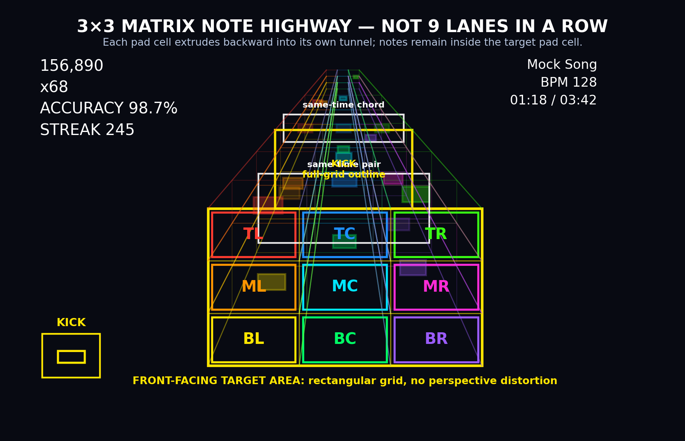

# Multipad Highway 3D Plugin Plan

Design reference: the target visual direction is a front-facing 3x3 pad matrix
where each pad cell extrudes backward into its own tunnel. Notes should remain
inside their target pad cell, including simultaneous hits, rather than becoming
nine separate lanes arranged in one horizontal row.

Mockup interpretation: treat the image as an abstract 3x3 performance grid, not
a literal Alesis Strike MultiPad physical layout. The default Alesis profile
should map its six main pads and three shoulder pads into this grid. Kick drum
hits should not use a separate lane or off-grid target in the MVP; represent
them as a yellow outline surrounding the entire multipad grid. The play surface
is a front-facing hit plane made of rectangular target cells, while the depth
behind it provides the highway/tunnel perspective. Same-time labels in the
mockup should become "hit group" in production docs and UI, meaning multiple
drum hits scheduled at the same time. Positional labels such as TL/TC/TR are
placeholders; real labels should come from the active profile, user settings, or
piece routing.

## 1. Best Practices for Developing Plugins for This Repository

Use the bundled plugins as the primary shape guide before writing new code. For this plugin, the closest local references are `plugins/drum_highway_3d`, `plugins/highway_3d`, and `plugins/keys_highway_3d`; useful upstream references include `got-feedBack/feedBack`, `got-feedBack/feedBack-plugin-drums`, `got-feedBack/feedBack-plugin-keys-highway-3d`, and `got-feedBack/feedBack-plugin-editor`.

Keep the plugin contract boring and explicit. A visualization plugin should declare `type: "visualization"` in `plugin.json`, register `window.feedBackViz_multipad_highway_3d`, and return a renderer object with the host `setRenderer` lifecycle: `init(canvas, bundle)`, `draw(bundle)`, `resize(w, h)`, and `destroy()`. Add `contextType: "webgl2"` when the renderer needs WebGL2, and keep `matchesArrangement(songInfo)` narrow enough that Auto mode does not steal guitar, bass, or keys arrangements from their own visualizers.

Prefer capability domains over private browser APIs. MIDI should go through the core `midi-input` domain as a requester, mirroring `drum_highway_3d` and the upstream 2D drums plugin. If the plugin emits scored hits/misses, declare and implement the relevant `note-detection` behavior rather than using an untracked window-global side channel. Every capability should fail soft when the host domain is absent.

Treat the highway bundle as read-only. For drum charts, prefer `bundle.drumTab` over decoding guitar-style `bundle.notes`; `static/highway.js` streams drum tab metadata and chunked hits from the server, and `lib/drums.py` is the canonical vocabulary for piece ids, default GM MIDI notes, categories, shapes, colors, presets, and wire normalization.

Make renderer state instance-safe. Splitscreen and renderer rehydration mean a plugin can be initialized more than once. Keep per-renderer scene state inside the factory instance, use module-level singletons only for browser-unique resources such as MIDI access or shared audio samples, and make every async open/connect path generation-safe so a late result cannot reattach a destroyed renderer.

Keep the draw path disciplined. Avoid per-frame DOM queries, broad `MutationObserver` work, unbounded allocations, and repeated material/geometry construction. Cache Three.js resources by chart/profile when practical, dispose GPU resources on teardown, honor `bundle.renderScale`, and preserve the canvas drift/reframe behavior already ported into `drum_highway_3d` and `keys_highway_3d`.

Validate all user-controlled data. Local storage, imported pad profiles, MIDI mappings, and settings should be read through guarded helpers, parsed defensively, clamped to sensible ranges, and stripped of prototype-pollution keys. Use a plugin-specific localStorage prefix such as `multipad_h3d_`.

Use self-contained assets and styles. If the settings UI or screen uses Tailwind classes that core may not ship, build a preflight-off plugin stylesheet under `assets/` and declare it via `styles`. Do not rely on runtime Tailwind, remote CSS, or CDN-only assets. Use the vendored Three.js copy under `/static/vendor/three/` wherever possible.

Plan for both v2 and v3 UI behavior. The renderer itself should work unchanged in both UIs. If future controls are injected into the player chrome, use the v3 plugin-control slot when available and keep v2 behavior intact. Settings should remain usable from Settings -> Plugins.

Keep contribution and release hygiene in view. The main FeedBack repo asks plugin contributors to use AGPL-compatible licensing for curated plugins, keep diagnostics redaction-safe, document hardware assumptions, and add tests that protect the renderer contract, capability declarations, routing, and performance-sensitive behavior.

## 2. Components Needed for `multipad_highway_3d`

`plugin.json` manifest: Declares `id: "multipad_highway_3d"`, user-facing name, version, visualization type, bundled status if promoted, script/settings/assets, category, description, icon, standards, and capability metadata. Expected capabilities are `visualization` provider and `midi-input` requester; `note-detection` provider should be added once hit/miss events are emitted.

Renderer factory and lifecycle: A `screen.js` factory registered as `window.feedBackViz_multipad_highway_3d`. It owns Three.js scene setup, canvas sizing, chart rendering, settings application, teardown, and test hooks. It should mirror the host contract used by `highway_3d`, `drum_highway_3d`, and `keys_highway_3d`.

Pad profile model: A structured representation of the physical controller layout mapped into the plugin's abstract 3x3 performance grid. The default profile should target the Alesis Strike MultiPad shape: 9 velocity-sensitive pads, treated as six main pads plus three smaller shoulder pads, mapped into the 3x3 grid shown in the mockup, with room for external triggers and pedals later. The model should stay generic enough for other multipads.

Pad geometry and coordinate map: Converts a pad profile into 3D landing zones, labels, hit regions, lighting zones, and camera framing. Unlike `drum_highway_3d`, the visual layout should feel like a pad controller grid instead of a linear row of lanes. The MVP kick visualization should be a yellow outline surrounding the full 3x3 grid; later profiles may add other kick styles only if they do not compromise the matrix-highway read.

Chart-to-pad routing layer: Converts `bundle.drumTab.hits` into renderable scheduled pad events. It maps canonical drum piece ids such as `kick`, `snare`, `hh_closed`, `hh_open`, `tom_hi`, `crash_l`, and `ride_bell` to the user's pad profile, applies fallback/drop routing, preserves variants such as accent, ghost, flam, open hi-hat, and bell, and sorts/caches chart events by time.

MIDI input/session layer: Uses `window.slopsmith.midiInput` through the core `midi-input` capability. It discovers sources, remembers the selected input, auto-connects to likely devices, supports channel filtering if needed, blocks obvious loopback ports, handles reconnect/disconnect races, and routes incoming note-on events to the focused renderer instance.

MIDI-to-pad mapping layer: Maps physical MIDI note numbers to pad ids or drum piece ids. It should support a factory default mapping, learn mode, per-profile overrides, import/export, validation, and fallback to GM percussion piece mapping when a controller sends standard drum notes.

Hit detection and scoring layer: Matches incoming MIDI hits to scheduled chart events within a drum-tight timing window, likely starting from the existing 50 ms window used by `drum_highway_3d` and upstream `feedBack-plugin-drums`. It dedupes hits, avoids retroactive misses when no device is connected, tracks combo/accuracy/score, and marks visual event state as pending/hit/missed.

Visual event and FX layer: Renders approaching notes, pad landing flashes, timing colors, sparks, combo feedback, ghost/accent/flam shapes, kick grid-outline pulses, hit group cues for same-time hits, and optional audio-reactive ambience. This layer should borrow stable shared helpers from `drum_highway_3d` and `highway_3d` only when the behavior truly matches.

Optional drum synth/audio feedback layer: Provides local audible pad feedback, probably by reusing the WebAudioFont drum-kit approach from the drum plugins. It must be optional and volume-controlled because the song audio remains the primary playback path.

Settings UI: A `settings.html` panel for MIDI device selection, pad profile selection/editing, learn mode, per-pad labels/colors, chart fallback routing, camera/graphics options, hit feedback intensity, optional synth volume, and profile import/export.

Test and diagnostics hooks: A small `__test` export for pure data helpers and a `window.__multipadH3dTest` hook for browser tests to inject synthetic pad hits, inspect score state, and probe visual effects without physical hardware.

Documentation and assets: A README, thumbnail asset, screenshots after implementation, license file if this becomes standalone, and concise notes explaining how multipad profiles differ from the existing linear drum highway.

Routes, only if needed: The MVP should not need server routes. Add `routes.py` only if later work introduces uploaded profiles, shared profile libraries, or server-side preset generation.

## 3. Component Dependencies

`plugin.json` depends on the chosen file layout and capability decisions. It should not claim `note-detection` until the scoring layer actually emits hit/miss behavior.

Renderer factory depends on the host visualization contract, vendored Three.js, the pad geometry map, chart routing, settings readers, and lifecycle-safe MIDI focus handling.

Pad profile model depends on the drum piece vocabulary from `lib/drums.py`, local settings persistence, and any hardware preset definitions. The Alesis Strike MultiPad preset is a default profile, not a renderer assumption.

Pad geometry and coordinate map depends on the active pad profile and visual settings. The renderer, chart routing, hit feedback, and settings preview all depend on this coordinate map.

Chart-to-pad routing depends on `bundle.drumTab`, the active pad profile, the profile's chart fallback rules, and the variant parser. It feeds both rendering and hit detection.

MIDI input/session depends on the core `midi-input` domain and the renderer-instance registry. It feeds the MIDI-to-pad mapping layer and must be able to shut down cleanly when the final renderer instance is destroyed.

MIDI-to-pad mapping depends on the active pad profile, the selected MIDI source, localStorage/import validation, and optional learn mode. Hit detection and synth feedback consume its resolved pad/piece result.

Hit detection and scoring depends on chart-to-pad routing, current chart time from the renderer bundle, MIDI-to-pad mapping, and the focused renderer instance. Stats/progression and note-detection events depend on scoring once they are added.

Visual event and FX layer depends on renderer lifecycle, pad geometry, chart-to-pad routing, scoring state, visual settings, and Three.js resource caches.

Optional synth/audio feedback depends on MIDI events, volume settings, browser AudioContext availability, and a loaded drum sample/preset set. It should not block rendering or scoring if audio initialization fails.

Settings UI depends on window APIs exposed by `screen.js`, safe localStorage-backed settings, device-list events from the MIDI layer, and profile validation helpers.

Test hooks depend on pure helper boundaries and renderer instance state. They should not require real MIDI devices, real WebAudio output, or private server state.

Recommended build order is: manifest plan, pure pad profile helpers, chart routing, renderer skeleton, 3D pad geometry, MIDI session, hit detection, settings UI, FX polish, diagnostics/stats, production hardening.

## 4. Testing Plan

Manifest and loader tests: Add a manifest contract test once `plugin.json` exists. Verify capability metadata passes `docs/plugin-manifest.schema.json`, declares only implemented domains, exposes category/description/icon metadata, and remains loadable when optional domains are absent.

Pure data tests: VM-load `screen.js` without DOM, localStorage, WebGL, MIDI, or audio. Test pad profile validation, profile import/export, default Alesis profile shape, fallback routing, MIDI-note validation, chart-hit normalization, variant precedence, timing classification, and malformed input handling.

Drum vocabulary integration tests: Reuse expectations from `tests/test_drums_lib.py`: known pieces route somewhere, unknown future pieces fail soft, open/closed hi-hat remain distinct, velocities are clamped/ignored safely, and hits are sorted by time.

MIDI-domain tests: Mock the `midi-input` domain to verify discover/open/close calls, saved source restoration, source-change events, none-selected behavior, reconnect generation guards, loopback filtering, channel filtering if present, learn mode, and no duplicate listener delivery across rehydration.

Scoring tests: Use synthetic hits to verify exact/on-time, early, late, wrong-pad, duplicate-hit, missed-note, seek-back, pause, reconnect, and no-device cases. Confirm no misses accumulate before a live MIDI handle is open.

Renderer contract tests: Check factory registration, `contextType`, narrow `matchesArrangement`, idempotent `init`/`destroy`, split-panel focus behavior, resource disposal patterns, and the canvas resize/reframe drift logic already protected for drum/keys highways.

Browser and visual tests: Add Playwright coverage that loads a drum-tab song, selects Multipad Highway 3D, asserts the WebGL canvas is nonblank, injects synthetic pad hits through `window.__multipadH3dTest`, observes score/flash state, and captures desktop/mobile/splitscreen screenshots.

Routing tests: Confirm Auto mode claims drum/percussion arrangements with drum tabs and does not claim Lead, Rhythm, Bass, Combo, Guitar, or notation-backed keys arrangements. Full-band packs should stay with the active instrument unless the active arrangement is drums.

Performance tests: Exercise dense drum charts and long sessions. Watch frame time, memory growth, GPU resource churn, and repeated renderer swaps. The draw loop should not query DOM or rebuild stable materials every frame.

Manual hardware tests: Test with an Alesis Strike MultiPad over USB MIDI, and if practical through 5-pin MIDI via an interface. Verify the default preset, learn mode, velocity response, pad labels, shoulder-pad readability, external trigger assumptions, disconnect/reconnect behavior, and browser permission flow.

Regression commands to start with once code exists: `node --test plugins/multipad_highway_3d/tests/*.test.js`, relevant `tests/js/*highway*` tests, `pytest tests/test_plugin_manifest_contract.py tests/test_drums_lib.py tests/test_highway_ws_instrument_routing.py`, and targeted Playwright specs for visualization loading.

## 5. Development Plan

Phase 1: Finalize the product shape. Lock the MVP profile schema, default Alesis-to-3x3 mapping, kick-as-grid-outline behavior, whether the plugin is bundled or standalone first, and exactly which capabilities will be claimed in the first implementation.

Phase 2: Add the plugin skeleton. Create `plugin.json`, `screen.js`, `settings.html`, `assets/thumb.svg`, README, and license metadata. Register the visualization factory, return a no-op renderer cleanly, and make the settings page load without errors.

Phase 3: Build pure data helpers. Implement pad profile validation, default profile, chart-piece fallback rules, MIDI-to-pad mapping, variant classification, and localStorage-safe settings. Add the VM tests before connecting WebGL.

Phase 4: Render the multipad highway MVP. Build the 3D pad grid, camera framing, front hit plane/target cells, chart-event placement, basic note meshes, and demo fallback. Then wire it to real `bundle.drumTab` data and confirm Auto mode stays narrow.

Phase 5: Add MIDI and scoring. Connect to the core `midi-input` domain, route events to the focused renderer, implement hit/miss matching, display combo/accuracy, and expose test injection hooks.

Phase 6: Add settings and profile editing. Build the MIDI device selector, profile picker, learn mode, pad labels/colors, fallback-routing editor, camera and graphics controls, synth volume if enabled, and profile import/export.

Phase 7: Polish visual feedback. Add pad flashes, timing colors, sparks, ghost/accent/flam/open/bell cues, optional synth feedback, score FX, and shared background/cinematic helpers where they make sense.

Phase 8: Integrate diagnostics and stats. Emit capability events, post end-of-run stats if matching the existing scoring contracts, keep diagnostics redaction-safe, and add enough hooks for the capability inspector and tests to explain failures.

Phase 9: Stabilize and document. Run the full targeted test suite, test with real hardware, profile performance, fix rehydration/splitscreen edge cases, update docs/screenshots, and prepare the plugin for review.

## 6. Additional Work to Get Production Ready

Hardware preset quality: The Alesis Strike MultiPad preset should be verified on a real unit, including the shoulder pads, velocity curves, default MIDI notes, USB MIDI naming, and any external trigger/pedal mappings that should be left unmapped in MVP.

Fallback behavior: Define what users see on browsers without Web MIDI, without WebGL2, without drum tabs, or with no selected MIDI device. The plugin should degrade visually without corrupting score state.

Accessibility and usability: Settings must be keyboard usable, labels should be clear, and controls should fit narrow panels. The 3D view should keep labels readable without relying only on color.

Security and privacy: Imported profiles, localStorage settings, MIDI device labels, and diagnostics should be sanitized. Public diagnostics should not leak local device identifiers beyond the pseudonymized patterns used elsewhere.

Performance hardening: Profile dense charts, long songs, repeated song swaps, and splitscreen. Confirm WebGL resources are disposed, sample loading is bounded, and background effects can be disabled on weaker devices.

Documentation: Add README usage notes, a profile-format section, hardware setup guidance, troubleshooting for Web MIDI permissions, screenshots, known limitations, and a short comparison with `drum_highway_3d`.

Release hygiene: Choose an AGPL-compatible license, maintain a changelog, bump versions when settings/styles/assets change, keep bundled and standalone histories clear if promoted to core, and include the plugin in any curated-list metadata only after tests and docs are complete.

QA matrix: Before production, test v2 UI, v3 UI, desktop browser, desktop app if applicable, splitscreen, selected-instrument routing, full-band sloppaks, drum-only sloppaks, missing drum tabs, and at least one real multipad.

## 7. Areas for Future Further Development

Additional controller profiles: Add presets for Roland SPD-SX/SPD-SX Pro, Yamaha DTX-Multi, Alesis SamplePad, Akai MPD-style pads, Launchpad-style grids, and user-shared custom profiles.

MIDI output and pad lighting: Explore whether supported controllers can receive MIDI feedback for pad LEDs, metronome pulses, hit/miss colors, or upcoming-note previews.

External triggers and pedals: Promote kick, hi-hat pedal, footswitches, dual-zone triggers, choke gestures, aftertouch, and control-change gestures into first-class profile inputs.

Advanced drum articulations: Add drags, ruffs, rolls, buzzes, cymbal chokes, stickings, left/right hand hints, double-kick notation, velocity-layer visuals, and per-piece timing windows.

Practice features: Add pad-specific drills, weak-pad review, adaptive difficulty, fills-only practice, groove loops, metronome subdivision overlays, and end-of-song feedback by pad.

Authoring workflow: Coordinate with editor/import tooling so drum-tab authors can target multipad profiles directly, preview pad layouts, and export recommended MIDI mappings with a song.

Multiplayer and splitscreen expansion: Support multiple MIDI controllers at once, per-panel device ownership, and drummer-plus-guitar practice sessions without fighting over input focus.

Visual themes and stage integration: Add hardware-inspired skins, alternate camera modes, stage/venue lighting sync, audience-facing performance mode, and lower-cost 2D/Canvas fallback visuals.

Profile sharing: Add a safe route-backed profile library or import/export format with validation, versioning, migration, and community presets once the local schema proves stable.
